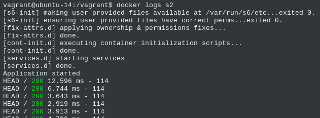

# Report : AIT Labo 04 : Docker and dynamic scaling
Yann Mahmoudi <yann.mahmoudi@heig-vd.ch> & Emmanuel Schmid <emmanuel.schmid@heig-vd.ch>
## Task 0
1. A production envirionnement has to be scalable and the current solution can't handle automatically and easily an increasment of the trafic.
   Adding or removing nodes involves a manual configuration and a resart of the containers. The service will be down and that's not a acceptable !

2 Follow the instructions to add a new server node to the current configuration
2.1 Start a new container (=server node)
    docker run -d --name -s3 softengheigvd/webapp
2.2 Add new web server node (s3) to the configuration file of HAProxy
    server s3 <s3>:3000 check
2.3 Update the run.sh script
    sed -i 's/<s3>/$S3_PORT_3000_TCP_ADDR/g' /usr/local/etc/haproxy/haproxy.cfg
2.4 Rebuild ha container
    docker build -t softengheigvd/ha .
2.5 Run ha container
    docker run -d -p 80:80 -p 1936:1936 -p 9999:9999 --link s1 --link s2 --link s3 --name ha softengheigvd/ha

3. A better approach consit in a dynamic configuration of haproxy.cfg when adding or removing a node. This approach matches the requirement of a production environnement which is scalability.

4. The configuration of the load balancer has to be automatic. To archieve this, there is a tool called "Serf" for cluster membership, failure detection, and orchestration that is decentralized, fault-tolerant and highly available. It allows to add/remove a node dynamically.

5. The current solution is not able to run beside processes in a single container. Docker has been designed to process only one process per container.
   To bypass this limitation, we'll use a process supervisor called "s6". This tool allows more than one process running in parallel in docker.

6. In this current solution adding more web server nodes won't work as excepted, because adding node to the load balancer configuration is hardcoded.
   It needs an human action. So it definitley not dynamic ! A dynamic solution will be implemented using Handlebars and template (nodeJS).
   Each time a node is added/removed, the Sref handler script will generated a configuration file for HAProxy.

### Deliverables
1. Take a screenshot of the stats page of HAProxy at http://192.168.42.42:1936. You should see your backend nodes.

2. Give the URL of your repository URL in the lab report : https://github.com/dbnsky/Teaching-HEIGVD-AIT-2016-Labo-Docker

## Task 1
### Deliverables
1. Take a screenshot of the stats page of HAProxy at http://192.168.42.42:1936. You should see your backend nodes. It should be really similar to the screenshot of the previous task.

2. Describe your difficulties for this task and your understanding of what is happening during this task. Explain in your own words why are we installing a process supervisor. Do not hesitate to do more research and to find more articles on that topic to illustrate the problem.

No problem encountered in this part.

As answered on question 5, installing a process supervisor allows docker to run simultaneously several processes(=several services).

## Task 2

[//]: <> (Anyway, in our current solution, there is kind of misconception around the way we create the Serf cluster. In the deliverables, describe which problem exists with the current solution based on the previous explanations and remarks. Propose a solution to solve the issue.)

There was no need for us to solve the DNS problem as our containers can communicate with each other already. 

### Deliverables
1. Provide the docker log output for each of the containers: ha, s1 and s2.
   -ha
   -s1
   -s2
2. Give the answer to the question about the existing problem with the current solution.

3. Give an explanation on how Serf is working. Read the official website to get more details about the GOSSIP protocol used in Serf. Try to find other solutions that can be used to solve similar situations where we need some auto-discovery mechanism.

Serf uses a gossip protocol so that all nodes can communicate with each other. The gossip protocol allows each node to communicate with a set number of other nodes thus creating a mesh-network allowing nodes to fail without compromising the whole network. Those failed nodes are quickly detected by the whole network thanks to a random probing technique.
For running applications on large cluster of computers, [Hadoop](https://hadoop.apache.org/) seems like a good solution.

## Task 3
### Deliverables
1. Provide the docker log output for each of the containers: ha, s1 and s2.
   - Ha logs: [start ha](./logs/task3/haStart.log)
   - S1 logs: [start s1](./logs/task3/s1Start.log)
   - S2 logs: [start s2](./logs/task3/s2Start.log)
   - Ha logs: [after s1 start](./logs/task3/haLogsAfterStartS1.log)
   - Ha logs: [after s2 start](./logs/task3/haLogsAfterStartS2.log)

2. Provide the logs from the ha container gathered directly from the /var/log/serf.log file present in the container. 
   - serf log  [logs](./logs/task3/serf.log)

## Task 4
### Deliverables

1. Take a look at the Docker documentation on image layers. Tell us about the pros and cons to merge as much as possible of the command.

 

2. Propose a different approach to architecture our images to be able to reuse as much as possible what we have done. Your proposition should also try to avoid as much as possible repetitions between your images.

  We could make a base image named `core`, itself being made `FROM debian:jessie`, on which we could build two other images `ha` and `webapp`. We would then need to properly install on those two images `haproxy` and `node` respectively. 
  The `core` image would contain everything shared between the two types of containers needed (such as `serf` and other packages).  

3. Provide the /tmp/haproxy.cfg file generated in the ha container after each step. Place the output into the logs folder like you already did for the Docker logs in the previous tasks. Three files are expected.

    The files are in the logs

4.Based on the three output files you have collected, what can you say about the way we generate it? What is the problem if any?

## Task 5
### Deliverables
1. Provide the file /usr/local/etc/haproxy/haproxy.cfg generated in the ha container after each step. Three files are expected.
   - haproxy.cfg : [after start ha](./logs/task5/haStartproxy.log)
   - haproxy.cfg : [after start s1](./logs/task5/s1StartProxy.log)
   - haproxy.cfg : [after start s1 & s2](./logs/task5/s2StartProxy.log)

   In addition, provide a log file containing the output of the docker ps console and another file (per container) with docker inspect <container>. Four files are expected.
   - Output of : [Docker ps console](./logs/task5/dockerps.log)
   - Output of : [Docker inspect ha](./logs/task5/inspectHa.log)
   - Output of : [Docker inspect s1](./logs/task5/inspectS1.log)
   - Output of : [Docker inspect s2](./logs/task5/inspectS2.log)

2. Provide the list of files from the /nodes folder inside the ha container. One file expected with the command output.
   - [list of files from the nodes folder](./logs/task5/ls.log)

3. Provide the configuration file after you stopped one container and the list of nodes present in the /nodes folder. One file expected with the command output. Two files are expected.
   - haproxy.cfg : [after stopping s1](./logs/task5/stopS1proxy.log)
   - [list of file from the node folder](./logs/task5/listNodeStopS1.log)

   In addition, provide a log file containing the output of the docker ps console. One file expected.
   - log file : [docker ps console](./logs/task5/dockerpsStopS1.log)

## Task 6
### Deliverables
1. Take a screenshots of the HAProxy stat page showing more than 2 web applications running. Additional screenshots are welcome to see a sequence of experimentations like shutting down a node and starting more nodes.

   Also provide the output of docker ps in a log file. At least one file is expected. You can provide one output per step of your experimentation according to your screenshots.

2. Give your own feelings about the final solution. Propose improvements or ways to do the things differently. If any, provide references to your readings for the improvements.

## Difficulties

## Conclusion
This lab was one of the most interesting that we've ever done! We really enjoy working on it and we've improved our knowledge related to Docker and HAProxy.
We are now aware about difficulties and concepts behind a dynamic scaling environment used in a production context.

